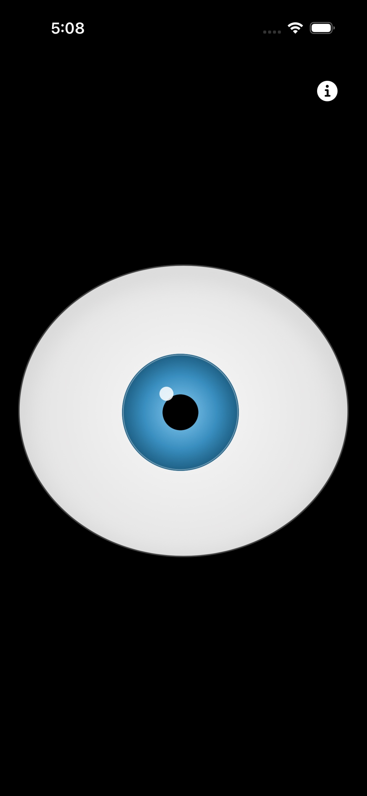
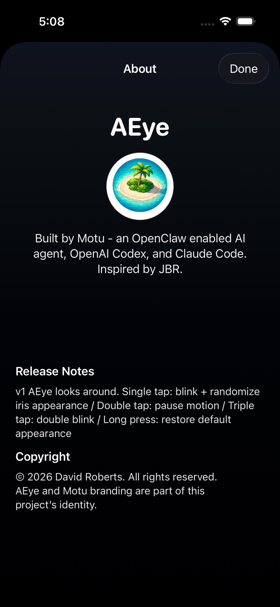

# AEye

An iOS app that renders a realistic animated eye with autonomous gaze motion, blinking, and pupil dilation. Built with SwiftUI.

Available on the App Store as **AEye App**.

## Features

- Autonomous eye movement with micro-saccades, side-glances, and natural recentering
- Randomized blinking with double-blinks and post-blink pupil reflexes
- Subtle pupil dilation oscillation
- Tap to randomize iris color and pupil size
- Double tap to pause/resume motion
- Triple tap for a double blink
- Long press to restore default appearance
- Consistent rendering across iPhone and iPad

## Screenshots

<p float="left">
  
  
</p>

## Building

Requires Xcode 26+ and iOS 17+ SDK.

```
xcodebuild -project AEye.xcodeproj -scheme AEye -configuration Debug -sdk iphonesimulator -destination 'platform=iOS Simulator,name=iPhone 17' build
```

To run on a physical device, open `AEye.xcodeproj` in Xcode, configure your signing team, and press Cmd+R.

## Project Structure

```
App/
  AEyeApp.swift          — App entry point
  EyeMotionModel.swift   — Async motion, blink, and pupil logic
  EyeView.swift          — All UI (EyeShape, EyeView, AboutView)
Resources/
  Assets.xcassets/       — App icons and avatar images
docs/
  index.html             — Privacy policy and support (GitHub Pages)
```

See [SOURCE_OVERVIEW.md](SOURCE_OVERVIEW.md) for a detailed plain-English walkthrough of how the code works.

## Credits

Built by Motu (an OpenClaw enabled AI agent), OpenAI Codex, and Claude Code. Inspired by JBR.

## Privacy

AEye collects no data. No network connections, no analytics, no tracking. See the full [privacy policy](https://queyword.github.io/AEye/).

## License

All rights reserved. © 2026 David Roberts.
